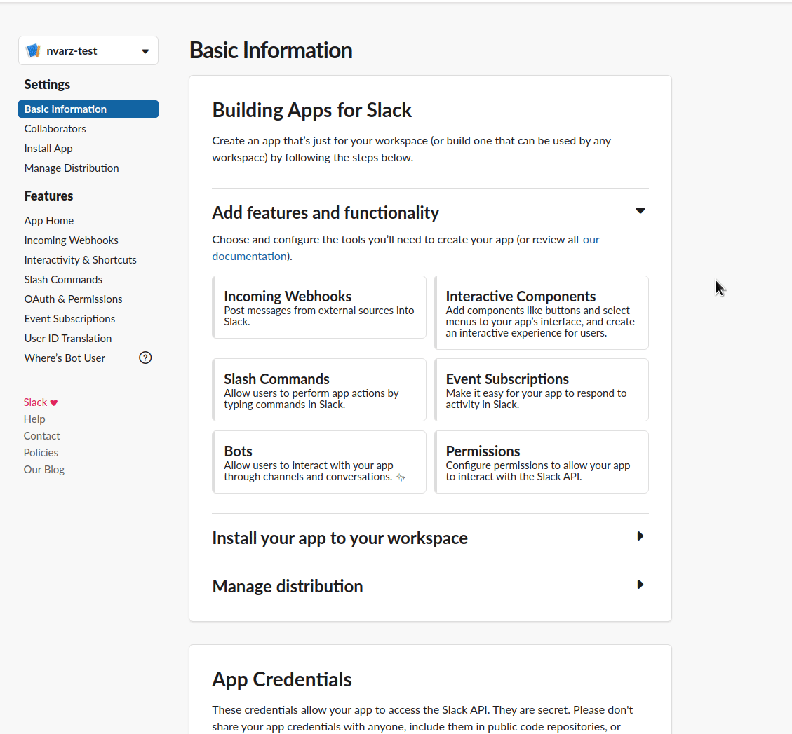
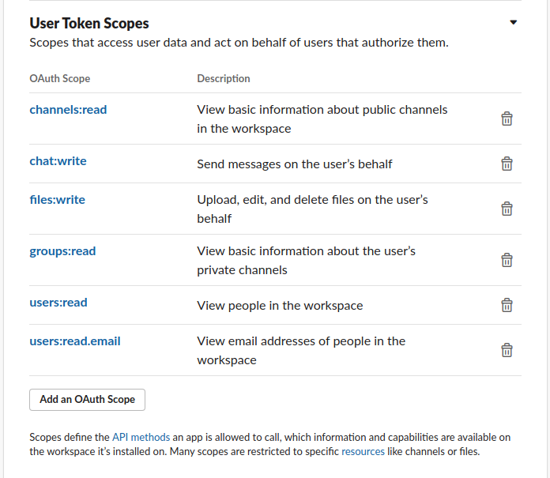
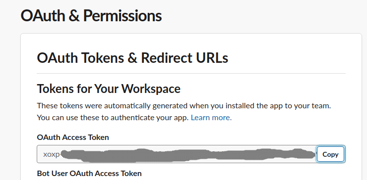

### Create new Slack App

To generate a token, you must first create a [new Slack App](https://api.slack.com/apps/new), and add it to your workspace.

Now grant API Permissions to your App, select all that apply:

This is an example of how it could look like:

Now hit the green `Install App to workspace` button, and you will be presented with a token you can use
for authentication.

